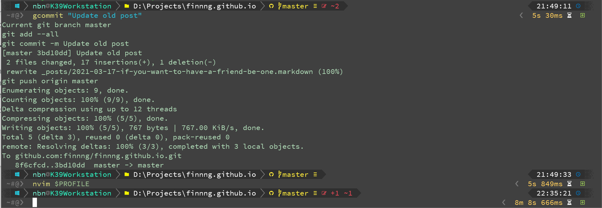

This is my third attempt to migrating the dev environment from Mac to Windows. I used to develop apps on Mac for 5 years. With all my muscle memory on key maps, productivity tools and the general UX is sticked to Mac, I can't think of moving to other OS, until the quarantine day. I got locked down at home for a month, and my 2017 Mac started to slow since I start C# development with Rider. And I have my gaming PC stay here just for Doto2. Wew, I think its time.

- The first attempt a year ago is about native app prebuild for Windows like nvim-qt, vscode, Windows terminal... I quit after a few days cause I miss my key map.

- After a few months, the second attempt is about WSL, this time I digged deeper to the real command line tools like curl, git, grep, gcloud, kubectl, autojump... And I'm too lazy for learning powershell way to do it, then I went with WSL. And you know what, WSL sucks, with a ton of troubles while install and using it through Windows terminal.

- And this time is the third.

I have to accept that I can't make the experience on Windows exactly like Mac. Since I know to live with compromise, I know how to deal with this situation. Beside, I don't want to be a sheeple which stick to every generation of Mac evenwhen it sucks. So, the first thing comes to mind is learn to compromise.

# The editor

The most frustrated thing with Windows is I can't config Vim - my main editor exactly like what I have in Mac. For example, I have Karabiner Elements to map `jk` to `esc`, its super productive while the escape is right at your finger, but I don't have it here. Fzf is experimenting on Windows, its buggy and doesn't work at all in my case, Windows terminal not very good with vim running inside...

> I have to config Rider and Vscode as much as I can, compromised with something missing.

# The command line

Git is the second most important tool. I have several alias function for git, which combine several commands in one function which helps save time on repeative tasks. It works on whatever shells except powershell... So I have to learn powershell way and transform those command one by one, like this:

> ```bash
> function gmerge() {
>   $CURRENT_BRANCH = & invoke-Expression gcurrent 2>&1
>   $TO_BRANCH="master"
> 
>   "> Merging $CURRENT_BRANCH -> $TO_BRANCH"
> 
>   "> git checkout $TO_BRANCH"
>   git checkout $TO_BRANCH
> 
>   "> git merge --no-ff $CURRENT_BRANCH"
>   git merge --no-ff $CURRENT_BRANCH
> 
>   "> git commit -m 'Merge branch $CURRENT_BRANCH'"
>   git commit -m "Merge branch $CURRENT_BRANCH"
> 
>   "> git push origin $TO_BRANCH"
>   git push origin $TO_BRANCH
> 
>   "> Delete $CURRENT_BRANCH branch from local"
>   git branch -D $CURRENT_BRANCH
> }
> 
> ```
> 
> The gmerge command to automatic merge a branch to master branch.

It is quite similar to bash shell syntax but it still need some research and transform all of them. I have like 10 frequently use command like that, e.g., tagging, rebasing, showing log, pull with rebase...

For the other command, Windows has scoop, it will install the prebuild cli program which works similar to the program on Linux or Mac. If scoop doesn't have that, MSYS2 comes to the rescure. Most frequently use is curl, gcloud, autojump, grep, cat, tail, pwd... So far the command line is quite the same.

# The terminal

Windows doesn't have much choice on the terminal app, cause most of them is ugly af. Windows terminal so far is the best, with true color, tab and pannel support, able to open all kinds of shells.



It still need a lot to improve but at least it good enough for now.

# Window management

## Hot key, remapping hot key

# TODO list

# Conclusion
